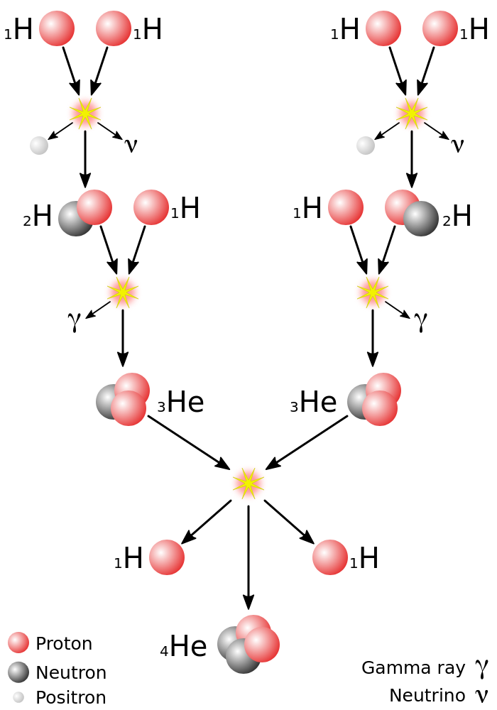

#+title: Info Clase

* Del taller 1 y aclaraciones para el taller 2:

- El $\mu = \sqrt{\mu_\alpha^2+\mu_\delta^2}$ es una aproximación
Realmente, la corrección es:

$\mu = \sqrt{(\mu_\alpha cos(\delta))^2 + \mu_\delta^2}$

- Gaia da el ángulo en mas, no se cumple:

  $d[pc] = \frac{1}{\pi ('')}$

  Con mas se multiplica por 1000:

  $d[pc] = \frac{1000}{\pi (mas)}$

- El brillo se atenúa puesto que los instrumentos están en la tierra -> se busca establecer una referencia.
* La materia prima de los astrónomos es la luz.

Ondas radio: $10^3$

1 Angstrom= 0.10 nm 
** Magnitud:

1: Brillante
3.5: Menos brillante

** Estandarización:

Placa con orificios.
Mido qué tanto veo por cada hueco pero también mido la distancia.
Los ángulos van cambiando -> brillo depende de la distancia a la que estoy.

$F \propto \frac{1}{d^2}$

1 estrella de magnitud 1 es 100 veces más grande que una estrella de magnitud 6.

De 6 a 5: Diferencia de k
De 6 a 4: Diferencia de $k^2$
De 6 a 1: $k^5$

Así, factor de brillo constante:

$k^5=100 \longrightarrow k= 2.512 = 10^{2/5}$

Así, dos estrellas que tengan una diferencia $\Delta m = m_2 - m_1$ en su magnitud aparente, diferirá su brillo por un factor de:

$k^{(m_2-m_1)} = \frac{b_1}{b_2} = \frac{F_1}{F_2}$

Despejando, entonces:

$m_2-m_1 = 2.5 \log (\frac{F_1}{F_2})$

Por convención, $m_1$ es aparente y $m_2$ es absoluta.

$m_1 - m_2 = -2.5\log (\frac{F_1}{F_2})$

Sirve para saber límite de telescopio.

La magnitud más tenue que pued ver con mi ojo es 6:

$6-m_{lim} = -2.5 \log \frac{D_{tel}^2}{(8mm)^2}$ 

O bien:

$m_{lim} \approx 1.48 + 5 \log{D_{tel}}$

** Módulo de la distancia:

Tenemos:

Escenario A: d_real y m -> Magnitud aparente
Escenario B: d= 10pc y M -> Magnitud absoluta

$m-M = -2.5 \log (\frac{F_m}{F_M}) = -2.5 \log (\frac{F_d}{F_{10}}) = -2.5 \log {(\frac{10}{d})}^2$
Usando leyes de logaritmos, llegamos al *módulo de la distancia*:

$m-M = -5 + 5log \, d \rightarrow M = m -5log \, d + 5$

* Taller 3: Topcat - Detección y análisis de cúmilos estelares jóvenes usando GAIA-DR3 (actual)

Vamos a ir a un cúmulo, ver cuáles están en secuencia principal y cuáles aún son jóvenes.

Se sabe de 2 millones de objetos: Posición, velocidad, brillo, temperatura, composición y tipo. Está en un punto de Lagrange.

** Filtro fotométrico:
Filtros pasa bandas MUY anchos.

* Apuntes 03-04-2026: Cúmulos estelares.
Satisfacen diferentes cosas:
- Cinemática compartida
- Co-espacialidad: Comparten coordenadas similares.
- Isocronía: Comparten edades parecidas
- Comparten una huella química.
- Distribución de masa: Función inicial de masa (IFM) predecible.

** Fundamentos físicos:
- Continuidad de Masa.
- Equilibrio Hidrostático.
- Transferencia radiativa
- Balance de Energía: Necesito suficiente masa y temperatura (calor generado por contracción)
** El motor estelar:
:PROPERTIES:
:ID:       ad73dcfd-7565-4b56-b916-b5963c5618a3
:END:

Debemos tener nucleosíntesis.
La liberación de energía por unidad de masa (q):

$q=q_0 \rho^m T^m$

Cuando tengo mayor masa, puedo superar los umbrales de temperatura.

En estrellas como el sol, domina *combustión de Hidrógeno: Cadenas p-p*.

#+DOWNLOADED: screenshot @ 2026-03-04 18:31:46

*83.3%* de Helio producido es por ese mecanismo.

Los otros, son generación de Helio-3 con otros elementos ó Helio-4 con Helio-3. Se puede formar Berilio y si no encuentra con quién reaccionar, puede decaer en Litio.

*Evolución química: Fase Avanzada:* Estrella como capas de cebolla.

* Taller:

Vamos a identificar un cúmulo: Queremos identificar cuáles son estrellas jóvenes y cuáles son las adultas, que ya se encuentran sobre la secuencia principal.

Un criterio para clasificar es la edad.

Más masivas, son las que más alumbran y tienen más temperaturas (Parte izquierda del diagrama)

* 06/03/26

""

